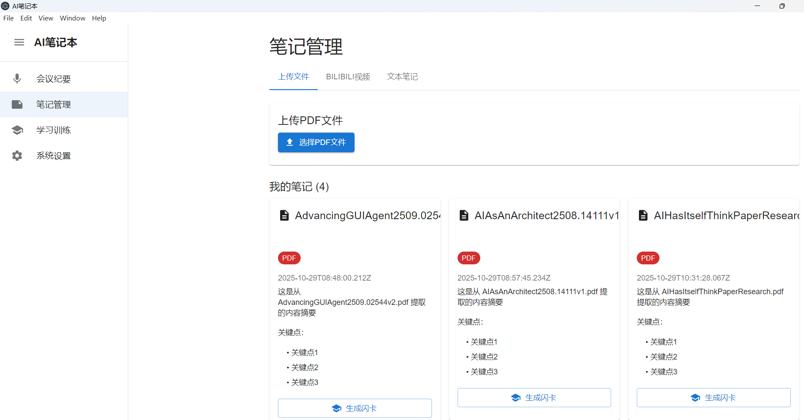
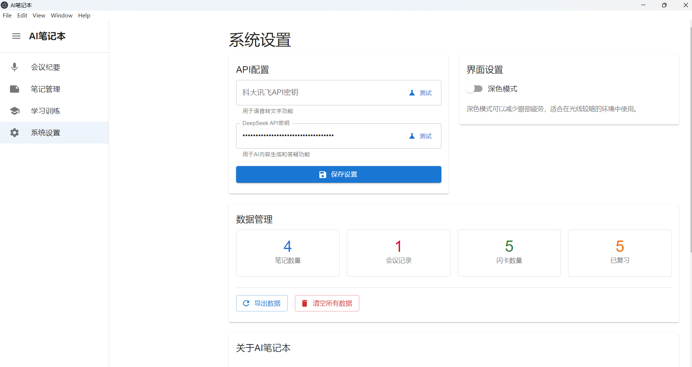
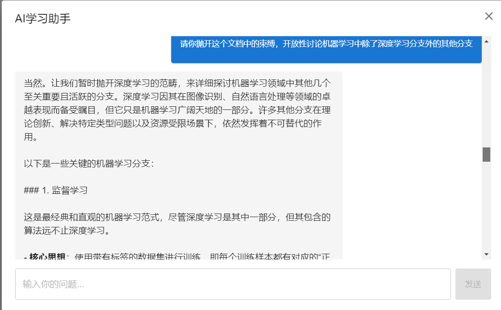

# AI笔记本 - 智能会议与学习笔记工具

## 项目简介

AI笔记本是一个智能化的笔记和学习工具，旨在帮助用户高效捕捉、处理和转化信息为可交互的学习资产。支持语音录制、文档上传、视频处理等功能，并能够生成结构化的笔记、闪卡和AI答疑助手。

## 功能特性

### 🎤 会议纪要模块
- 实时语音录制（支持暂停/继续/停止）
- 语音转文字（集成科大讯飞ASR API）
- 自动生成结构化会议纪要
- 卡片式展示，支持编辑和导出

### 📝 笔记管理模块
- 支持PDF文件上传和处理
- 支持Bilibili视频链接处理
- 支持文本笔记创建
- AI自动生成摘要和关键点

### 🧠 学习训练模块
- 闪卡管理系统
- 出题训练功能
- AI学习助手答疑
- 学习进度统计

### ⚙️ 系统设置模块
- API密钥配置（科大讯飞ASR、DeepSeek LLM）
- 数据导入导出
- 界面主题设置

## 技术栈

- **前端框架**: React 18 + TypeScript
- **UI组件库**: Material-UI (MUI)
- **桌面框架**: Electron
- **状态管理**: Zustand
- **构建工具**: Vite
- **API集成**: 科大讯飞ASR、DeepSeek LLM

## 安装和运行

### 环境要求

- Node.js 16.0 或更高版本
- npm 或 yarn 包管理器
- Windows 10/11 操作系统

### 安装依赖

```bash
npm install
```

### 开发模式运行

```bash
# 启动开发服务器
npm run dev

# 或者分别启动渲染进程和主进程
npm run dev:renderer  # 启动渲染进程
npm run dev:main      # 启动主进程
```

### 生产构建

```bash
# 构建应用程序
npm run build

# 构建Windows安装包
npm run dist:win
```

## 配置说明

### API密钥配置

1. 打开应用程序
2. 进入"系统设置"页面
3. 配置以下API密钥：

#### 科大讯飞ASR API
- 用于语音转文字功能
- 获取地址：https://www.xfyun.cn/
- 需要申请语音听写服务

#### DeepSeek LLM API
- 用于AI内容生成和答疑
- 获取地址：https://platform.deepseek.com/
- 默认已预填测试密钥

### 使用说明

#### 会议纪要
1. 点击"开始录音"按钮开始录制
2. 可以暂停/继续录制
3. 点击"停止录音"结束录制
4. 系统自动进行语音转文字和纪要生成

#### 笔记管理
1. 选择"上传文件"标签页上传PDF文件
2. 选择"Bilibili视频"标签页处理视频链接
3. 选择"文本笔记"标签页创建文本笔记
4. 系统自动生成摘要和关键点

#### 学习训练
1. 在"闪卡管理"中创建学习卡片
2. 在"出题训练"中进行记忆训练
3. 在"AI助手"中与AI对话答疑

## 项目结构

```
src/
├── components/          # 通用组件
│   └── Sidebar.tsx     # 侧边栏导航
├── pages/              # 页面组件
│   ├── MeetingPage.tsx # 会议纪要页面
│   ├── NotesPage.tsx   # 笔记管理页面
│   ├── LearningPage.tsx# 学习训练页面
│   └── SettingsPage.tsx# 系统设置页面
├── services/           # 服务层
│   └── apiService.ts   # API服务
├── store/              # 状态管理
│   └── appStore.ts     # 应用状态
├── main/               # 主进程
│   ├── main.ts         # 主进程入口
│   ├── preload.ts      # 预加载脚本
│   └── utils.ts        # 工具函数
└── renderer/           # 渲染进程
    └── main.tsx        # 渲染进程入口
```

## 开发说明

### 添加新功能

1. 在相应的页面组件中添加UI
2. 在`apiService.ts`中添加API调用逻辑
3. 在`appStore.ts`中添加状态管理
4. 在`main.ts`中添加IPC处理程序

### 调试

- 开发模式下会自动打开开发者工具
- 可以在渲染进程中使用`console.log`调试
- 主进程日志会在终端中显示

## 故障排除

## 运行截图











### 常见问题

1. **语音录制失败**
   - 检查麦克风权限设置
   - 确保浏览器允许访问麦克风

2. **API调用失败**
   - 检查网络连接
   - 验证API密钥是否正确
   - 查看控制台错误信息

3. **构建失败**
   - 确保Node.js版本符合要求
   - 清除node_modules重新安装
   - 检查网络连接（构建需要下载Electron）

### 日志查看

- 开发模式：查看浏览器开发者工具控制台
- 生产模式：查看应用程序日志文件

## 许可证

MIT License

## 贡献

欢迎提交Issue和Pull Request来改进这个项目。

## 更新日志

### v1.0.0
- 初始版本发布
- 支持会议纪要、笔记管理、学习训练等核心功能
- 集成科大讯飞ASR和DeepSeek LLM API

## 未来发展规划
- v1.1.0 (近期计划)
   数据云同步功能
   离线模式支持  更多导出格式支持  性能优化和bug修复

- v2.0.0 (多平台扩展) Android应用开发 iOS应用开发 macOS应用支持 跨设备数据同步 Web版本开发

- v3.0.0 (AI功能增强) 多模态AI支持（图像、视频理解） 个性化学习推荐 协作学习功能 高级分析仪表板